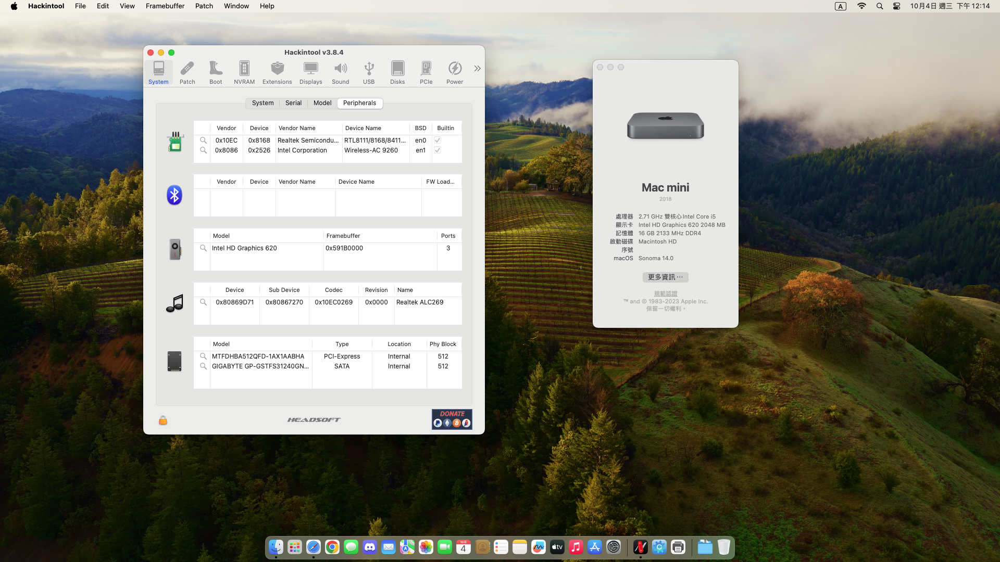
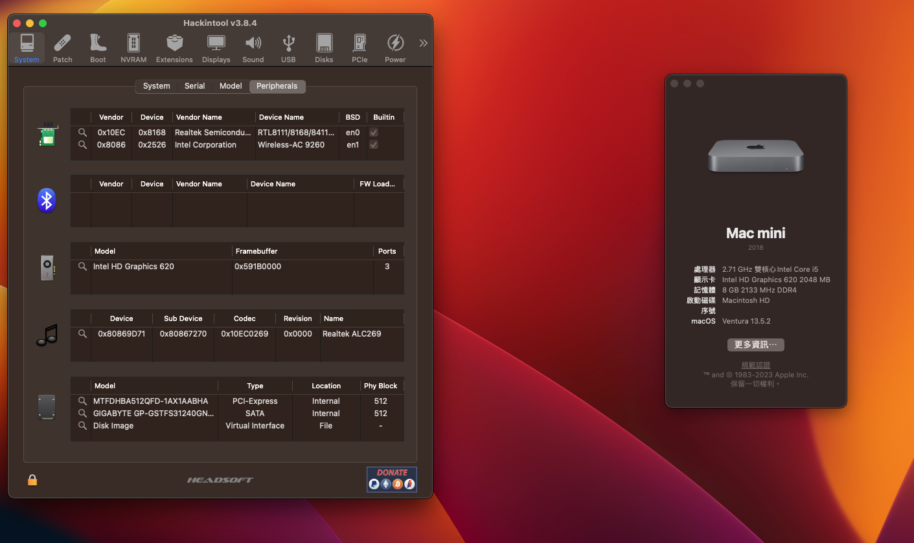

# ACEPC-CK2-Kabylake-OC-Hackintosh

## 🖥️Device

| Motherboard | ACEPC-CK2 |
|------------|-------------------------------|
| CPU | Intel i5-7200u |
| iGPU | Intel® HD Graphics 620 |
| RAM | DDR4 16GB |
| Audio | Realtek ALC629 |
| WIFI／Bluetooth | intel AC-9260 |
| Ethernet | Realtek® 8111 |
| BIOS Version | Unknow |

## OS
### macOS Sonoma 

|  |
|------------|
| <a href="https://www.apple.com/tw/macos/sonoma/">macOS Sonoma 14.0|
| <a href="https://github.com/dortania/build-repo/releases/tag/OpenCorePkg-408f000">Opencore 0.9.5 |
| <a href="https://dortania.github.io/OpenCore-Install-Guide/extras/smbios-support.html#how-to-decide">macmini 8.1 |
### macOS Ventura

|  |
|------------|
| <a href="[https://www.apple.com/tw/macos/macos-ventura-preview/](https://www.apple.com/tw/newsroom/2022/10/macos-ventura-is-now-available/)">macOS Ventura 13.6|
| <a href="https://github.com/acidanthera/OpenCorePkg/releases/tag/0.9.5">Opencore 0.9.5 |
| <a href="https://dortania.github.io/OpenCore-Install-Guide/extras/smbios-support.html#how-to-decide">macmini 8.1 |

## 💡Device status
### Works：
- [x] Graphics
- [x] USB
- [x] Sleep
- [x] WiFi
- [x] Speakers
- [x] Microphone
- [x] Bluetooth
- [x] Ethernet
- [x] AirDrop
- [x] Apple Services

## 🛠️Setting BIOS

- CFG Lock：`Disable,You need to use CFGLock.efi`

- After unlocking CFG Lock, the following entries in config can be turned off：
  
  `Kernel > Quirks > AppleCpuPmCfgLock：false`
  
  `Kernel > Quirks > AppleXcpmCfgLock：false`

